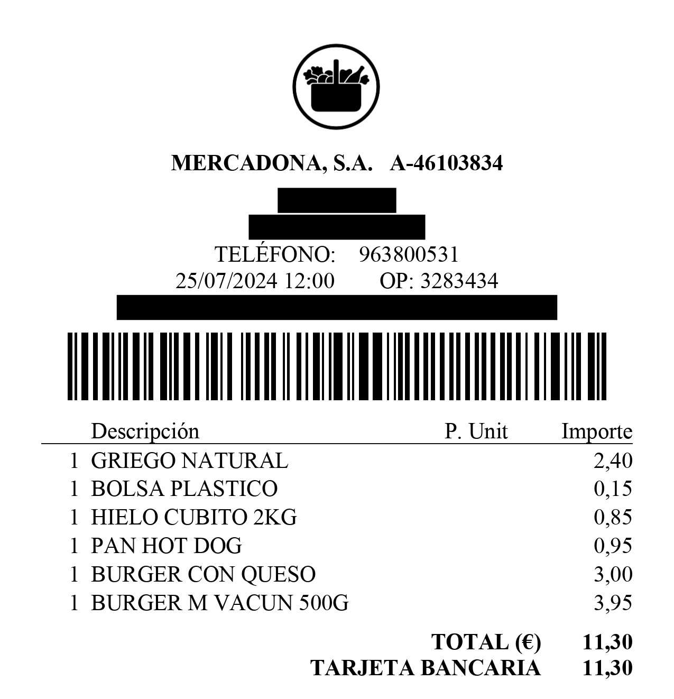

# mercadona
Utility functions to ease my shopping list in Mercadona parsing the ticker.



## Installation
Install dependencies with poetry:
```bash
poetry install
```

## Usage
This is a simple example of how to use the parser contained in the [sample file](sample.py).
```python
from mercadona.ticket_parser.parser import build_ticket

ticket = build_ticket('example/example.pdf')

print(f"Bought at: {ticket.bought_at}")
print("Products:")
for product in ticket.products:
    print(f"  - {product.name}: {product.price}€ X {product.quantity}")

```

To run it, you can use the following command:
```bash
poetry run python sample.py
```

The output of this script will be:
```bash
Bought at: 2024-07-25 12:00:00
Products:
  - GRIEGO NATURAL: 2.4€ X 1
  - BOLSA PLASTICO: 0.15€ X 1
  - HIELO CUBITO 2KG: 0.85€ X 1
  - PAN HOT DOG: 0.95€ X 1
  - BURGER CON QUESO: 3.0€ X 1
  - BURGER M VACUN 500G: 3.95€ X 1
```
